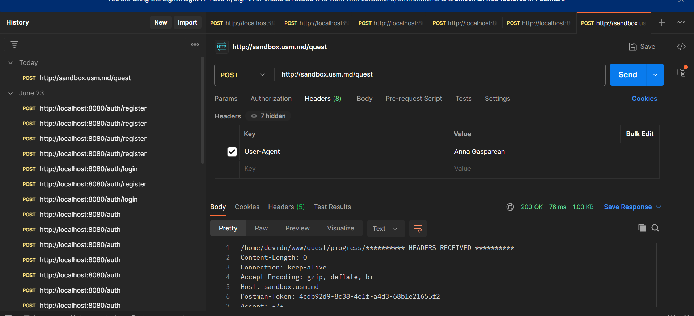
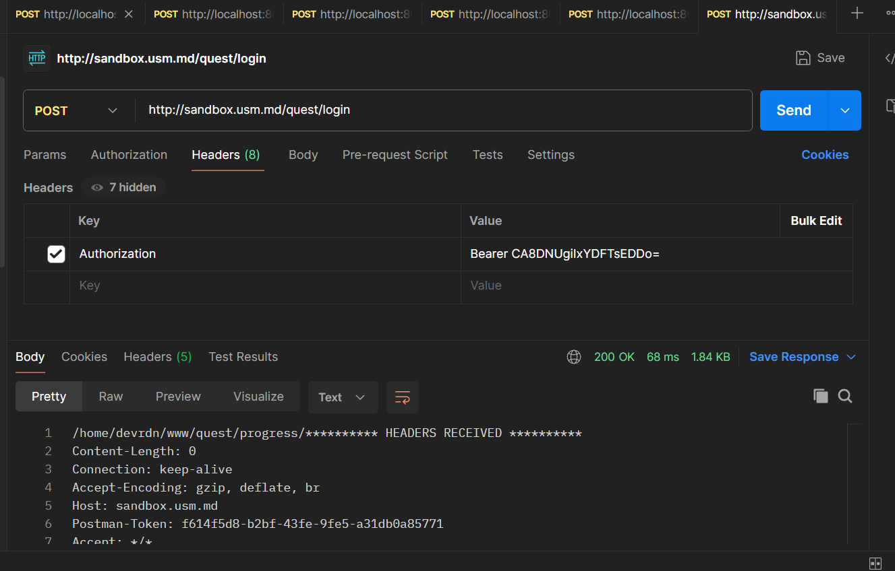
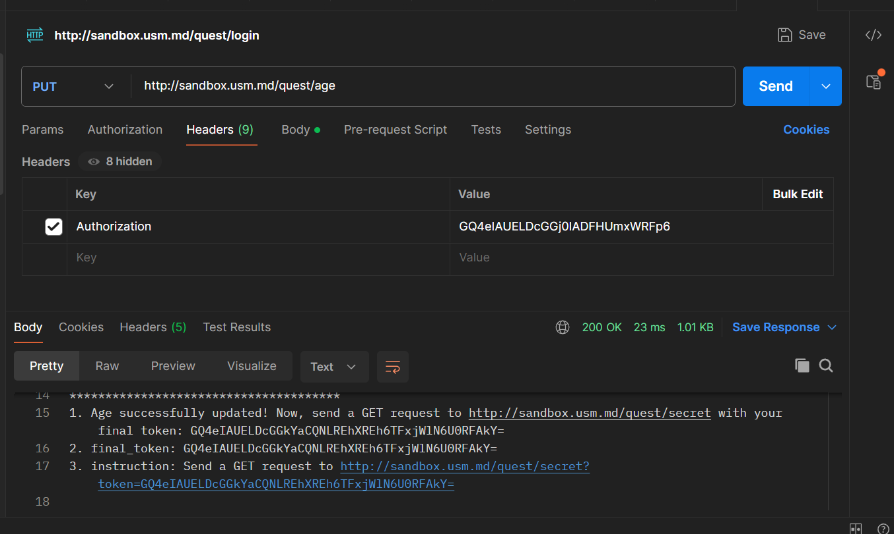
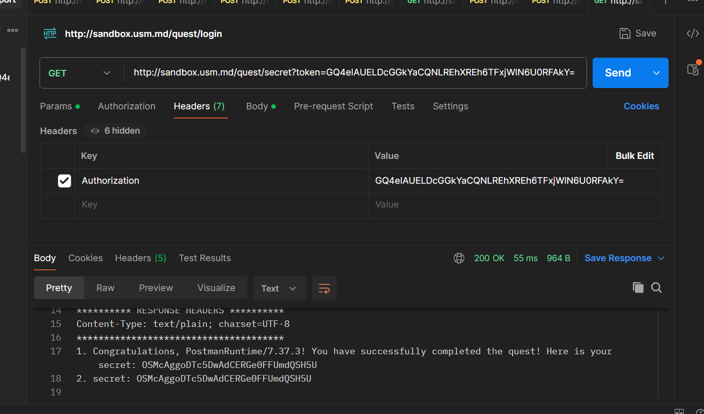

# Отчет по проекту

### Инструкции по запуску проекта
Клонирование репозитория https://github.com/GASPAREAN/lab1_HTTP.git

### Описание индивидуальной работы
Проект разработан для демонстрации взаимодействия с готовым RESTful API. В ходе работы была реализована отправка и создание различных типов HTTP-запросов (GET, POST, PUT) с использованием Postman для тестирования API.

# Задание №1. Анализ HTTP-запросов

### Отчет по анализу сетевого запроса на сайте http://sandbox.usm.md/login:

##### 1) Какой метод HTTP был использован для отправки запроса?
- HTTP-метод: POST.

##### 2)  Какие заголовки были отправлены в запросе?
- accept: Указывает, что клиент готов принимать любой тип данных в ответе от сервера (*/* означает, что все типы поддерживаются).
- accept-encoding: Показывает, какие методы сжатия данных поддерживает клиент, например, gzip и deflate.
- accept-language: Предпочтительные языки для ответа от сервера. В данном случае это английский (en-US) и русский (ru).
- cache-control: Указывает серверу не использовать кэш и всегда запрашивать свежие данные (значение no-cache).
- connection: Инструкция серверу поддерживать соединение открытым для дальнейших запросов (значение keep-alive).
- content-length: Длина тела запроса, измеренная в байтах — 37 байт.
- content-type: Формат передаваемых данных в запросе. application/x-www-form-urlencoded с использованием кодировки UTF-8.
- host: Доменное имя сервера, к которому отправляется запрос (sandbox.usm.md).
- origin: Источник, откуда был отправлен запрос (URL страницы, с которой сделан запрос).
- pragma: Указывает браузеру и серверу игнорировать кэшированные данные (значение no-cache).
- referer: Страница, откуда был произведен переход (http://sandbox.usm.md/login/).
- user-agent: Информация о клиентском браузере и операционной системе (здесь Chrome на Windows 10).
- x-requested-with: Указывает, что запрос был отправлен с помощью AJAX (значение XMLHttpRequest).

##### 3)  Какие параметры были отправлены в запросе?
В первом случае(неправильном):
- username=student, password=studentpass.

Во втором случае(правильном):
- username=admin&password=password

##### 4)  Какой код состояния был возвращен сервером?
В первом случае(неправильном):
- 401 Unauthorized.

Во втором случае(правильном):
- 200 OK (Запрос успешно выполнен).

##### 5)  Какие заголовки были отправлены в ответе?
- connection: Указывает, что соединение поддерживается открытым для дальнейших запросов (значение keep-alive).
- content-type: Тип данных, возвращаемых сервером (в данном случае — простой текст с кодировкой UTF-8).
- date: Дата и время, когда сервер сгенерировал ответ.
- server: Информация о сервере, который обработал запрос (здесь это nginx/1.24.0 на Ubuntu).
- transfer-encoding: Способ передачи данных, в данном случае это "chunked" (данные передаются частями).

# Задание №2. Составление HTTP-запросов
##### GET-запрос
GET-запрос к серверу по адресу http://sandbox.com, с указанием в заголовке User-Agent имени и фамилии :

GET / HTTP/1.1
Host: sandbox.com
User-Agent: Anna Gasparean

##### POST-запрос
POST-запрос к серверу по адресу http://sandbox.com/cars, с указанием параметров в теле запроса:

POST /cars HTTP/1.1
Host: sandbox.com
Content-Type: application/x-www-form-urlencoded

make=Toyota&model=Corolla&year=2020

##### PUT-запрос
PUT-запрос к серверу по адресу http://sandbox.com/cars/1, с указанием заголовков и JSON-тела:

PUT /cars/1 HTTP/1.1
Host: sandbox.com
User-Agent: Ivan Ivanov
Content-Type: application/json

{
"make": "Toyota",
"model": "Corolla",
"year": 2021
}

##### Возможный вариант ответа сервера на POST-запрос
Запрос:

POST /cars HTTP/1.1
Host: sandbox.com
Content-Type: application/json
User-Agent: John Doe

{
"model": "Corolla",
"make": "Toyota",
"year": 2020
}

###### Ответ сервера (например):

HTTP/1.1 201 Created
Content-Type: application/json
Location: http://sandbox.com/cars/1

{
"id": 1,
"make": "Toyota",
"model": "Corolla",
"year": 2020
}

##### HTTP-коды состояния и возможные сценарии
- 200 OK:
  Успешное выполнение запроса. Обычно это GET-запрос возвращает данные о ресурсе. Если как в примере POST наверное similar to 201 - все хорошо

- 201 Created:
  Успешное создание ресурса. Например, POST-запрос создал новую запись о машине, и сервер вернул ID созданного объекта.

- 400 Bad Request:
  Некорректный запрос. Например, в POST-запросе отсутствует обязательный параметр или неверный формат данных (например, неверный формат JSON).

- 401 Unauthorized:
  Необходима аутентификация. Например, запрос требует авторизации, но токен или другие учетные данные не были предоставлены.

- 403 Forbidden:
  Доступ к ресурсу запрещен, даже если пользователь аутентифицирован. Например, пользователь не имеет прав для выполнения данного действия.

- 404 Not Found:
  Запрашиваемый ресурс не найден. Например, попытка обратиться к несуществующему пути /cars/999, где нет записи с таким ID.

- 500 Internal Server Error:
  Внутренняя ошибка сервера. Например, сбой в обработке запроса из-за неправильной работы приложения на стороне сервера.

# Задание №3. Дополнительное задание. HTTP_Quest

1. Congratulations, PostmanRuntime/7.37.3! You have successfully completed the quest! Here is your secret: OSMcAggoDTc5DwAdCERGe0FFUmdQSH5U
2. secret: OSMcAggoDTc5DwAdCERGe0FFUmdQSH5U

### Список использованных источников
https://learning.postman.com/docs/getting-started/first-steps/sending-the-first-request/
https://iit-web-lectures.readthedocs.io/ru/latest/www/http.html

### Дополнительные важные аспекты
Следует использовать подходы для обеспечения безопасности данных, такие как аутентификация токенов.
